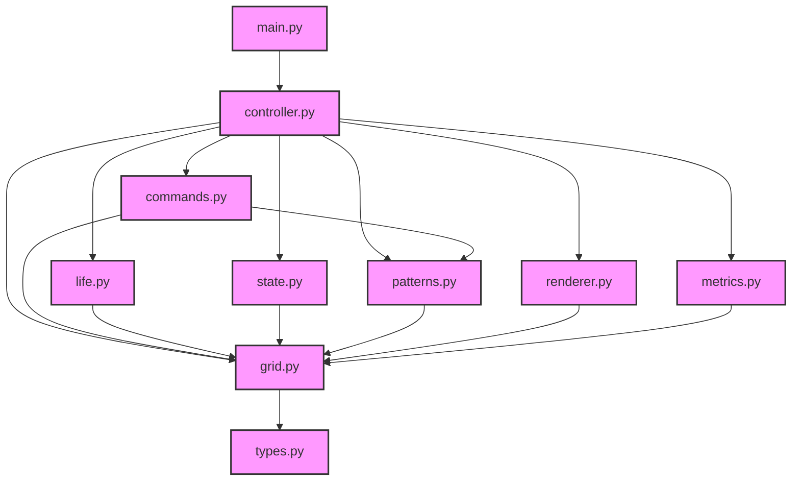

# Dependencies

## Runtime Dependencies

- **numpy**: Grid operations
- **blessed**: Terminal UI
- **typing-extensions**: Type hints
- **attrs**: Immutable data
- **result**: Error handling

## Development Dependencies

- **pytest**: Testing
- **pytest-cov**: Coverage
- **mypy**: Type checking
- **ruff**: Linting
- **black**: Formatting
- **isort**: Import sorting

## Module Dependencies

## Module Responsibilities

### Core

- **types.py**: Type definitions and protocols
- **grid.py**: Grid operations and boundaries
- **life.py**: Game rules and transitions
- **state.py**: Game state management
- **patterns.py**: Pattern operations

### Shell

- **commands.py**: Input handling
- **renderer.py**: Terminal UI
- **controller.py**: Game coordination
- **main.py**: Application entry
- **metrics.py**: Performance tracking

## Development Tools

### Code Quality

- **mypy**: Type checking
- **ruff**: Linting
- **black**: Formatting
- **isort**: Import sorting

### Testing

- **pytest**: Testing framework
- **pytest-cov**: Coverage reporting
