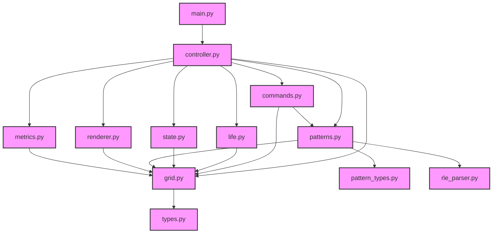

# Dependencies

## Runtime Dependencies

- **scipy>=1.12.0**: Grid operations and scientific computing
- **blessed>=1.20.0**: Terminal UI

## Development Dependencies

- **pytest>=8.0.0**: Testing
- **black>=24.0.0**: Formatting
- **ruff>=0.3.0**: Linting
- **mypy>=1.9.0**: Type checking
- **types-setuptools>=75.0.0**: Type stubs for setuptools

## Module Dependencies

## Module Responsibilities

### Core

- **types.py**: Type definitions and protocols
- **grid.py**: Grid operations and boundaries
- **life.py**: Game rules and transitions
- **state.py**: Game state management
- **patterns.py**: Pattern operations and management
- **pattern_types.py**: Pattern-related type definitions
- **rle_parser.py**: RLE pattern format parser

### Shell

- **commands.py**: Input handling and command processing
- **renderer.py**: Terminal UI and display management
- **controller.py**: Game coordination and state management
- **main.py**: Application entry and configuration
- **metrics.py**: Performance tracking and optimization

## Development Tools

### Code Quality

- **mypy**: Static type checking
- **ruff**: Fast Python linter
- **black**: Code formatting
- **isort**: Import sorting (via ruff)

### Testing

- **pytest**: Testing framework
- **pytest-cov**: Coverage reporting (via pytest)
