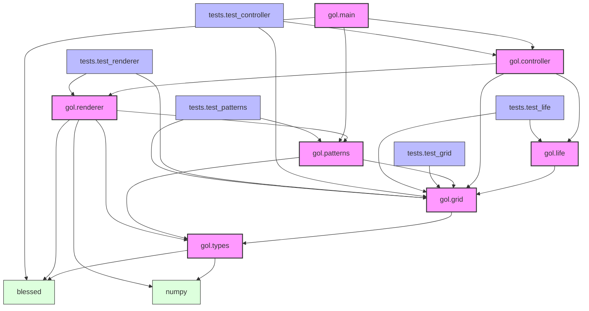

<!-- markdownlint-disable MD033 -->

# Module Dependencies

This document shows the dependencies between different modules in the Game of Life implementation.

## Core Module Dependencies

## Module Responsibilities

### Core Modules

- **gol.types**: Type definitions and aliases
  - Defines core type system using NumPy arrays and Blessed types
  - Provides type aliases for grid operations and pattern transformations
  - Ensures consistent typing across modules

- **gol.grid**: Core grid operations and boundary conditions
  - Implements grid operations using NumPy arrays
  - Handles boundary conditions and neighbor calculations
  - Provides efficient array-based operations

- **gol.life**: Game of Life rules implementation
  - Applies game rules using vectorized operations
  - Depends on grid operations for state transitions
  - Optimized for NumPy array operations

- **gol.controller**: Game state management
  - Coordinates between components
  - Manages game state and configuration
  - Handles game loop and state transitions

- **gol.renderer**: Terminal display and user input
  - Implements efficient grid rendering using Blessed
  - Handles pattern preview and placement
  - Manages terminal display and user interaction
  - Uses type-safe pattern transformations

- **gol.patterns**: Pattern management and manipulation
  - Manages pattern storage and loading
  - Implements pattern transformations
  - Provides pattern placement operations
  - Uses NumPy arrays for pattern storage

- **gol.main**: Application entry point and game loop
  - Initializes game components
  - Manages main game loop
  - Handles configuration and startup
  - Provides CLI interface using Blessed

### Test Modules

- **tests.test_grid**: Tests for grid operations
  - Verifies NumPy array operations
  - Tests boundary conditions
  - Validates neighbor calculations

- **tests.test_life**: Tests for game rules
  - Tests game rule implementation
  - Verifies state transitions
  - Validates cell evolution

- **tests.test_controller**: Tests for game state management
  - Tests game state transitions
  - Verifies configuration handling
  - Validates game loop behavior

- **tests.test_renderer**: Tests for display functionality
  - Tests rendering operations
  - Verifies pattern preview
  - Validates user input handling

- **tests.test_patterns**: Tests for pattern management
  - Tests pattern loading and storage
  - Verifies pattern transformations
  - Validates pattern placement

## Key Dependencies

1. **Type System**
   - `gol.types` provides NumPy and Blessed type definitions
   - Ensures type safety across all modules
   - Defines specialized types for patterns and transformations

2. **Grid Operations**
   - `gol.grid` implements efficient NumPy array operations
   - Provides optimized neighbor calculations
   - Handles boundary conditions using array operations

3. **Game Logic**
   - `gol.life` uses vectorized operations for rule application
   - Optimized for performance with NumPy arrays
   - Maintains pure functional approach

4. **State Management**
   - `gol.controller` coordinates component interactions
   - Manages game state transitions
   - Handles configuration and user input

5. **User Interface**
   - `gol.renderer` provides efficient terminal display using Blessed
   - Implements type-safe pattern transformations
   - Uses optimized NumPy operations for updates

6. **Pattern Management**
   - `gol.patterns` handles pattern operations
   - Uses NumPy arrays for pattern storage
   - Provides type-safe pattern transformations

## External Dependencies

- **NumPy**: Core numerical operations
  - Used for efficient array operations
  - Provides optimized grid manipulations
  - Enables vectorized calculations

- **Blessed**: Terminal handling
  - Manages terminal display
  - Handles user input
  - Provides terminal formatting

- **psutil**: System monitoring
  - Used for process and system monitoring
  - Helps with performance optimization
  - Provides system resource information
   