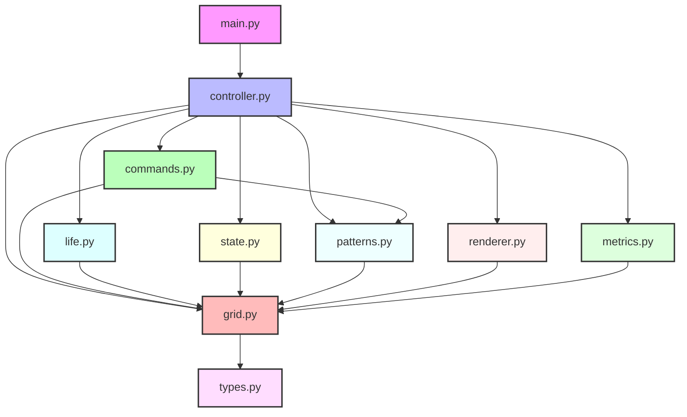
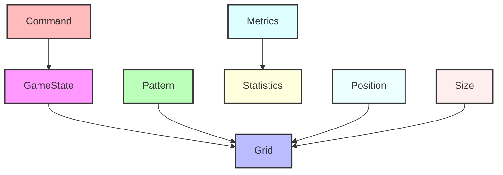

<!-- markdownlint-disable MD033 -->

# Module Dependencies

## Core Dependencies

- **numpy**: Grid operations and efficient array manipulation
- **blessed**: Terminal UI and input handling
- **typing-extensions**: Extended type hints support
- **attrs**: Immutable data structures
- **result**: Error handling with Result types

## Development Dependencies

- **pytest**: Testing framework
- **pytest-cov**: Test coverage reporting
- **mypy**: Static type checking
- **ruff**: Fast Python linter
- **black**: Code formatting
- **isort**: Import sorting

## Module Dependency Graph

## Module Responsibilities

### Core Modules

#### types.py

- Type definitions
- Type aliases
- Protocol classes

#### grid.py

- Grid creation and manipulation
- Neighbor calculations
- Boundary handling

#### life.py

- Game rules implementation
- Generation processing
- State transitions

#### state.py

- Game state management
- Mode transitions
- State validation

#### patterns.py

- Pattern loading and storage
- Pattern manipulation
- Pattern placement

### Shell Modules

#### commands.py

- Input processing
- Command execution
- Mode-specific handling

#### renderer.py

- Terminal UI
- Frame rendering
- Status display

#### controller.py

- Game initialization
- Loop coordination
- State management

#### main.py

- Application entry
- Configuration
- Signal handling

#### metrics.py

- Performance tracking
- Statistics calculation
- Metrics storage

## Type Dependencies

## Testing Dependencies

Each module has a corresponding test file:

- test_grid.py → grid.py
- test_life.py → life.py
- test_state.py → state.py
- test_patterns.py → patterns.py
- test_commands.py → commands.py
- test_renderer.py → renderer.py
- test_controller.py → controller.py
- test_metrics.py → metrics.py

## Development Tools

### Code Quality

- **mypy**: Static type checking
- **ruff**: Fast Python linter
- **black**: Code formatting
- **isort**: Import sorting

### Testing

- **pytest**: Test framework
- **pytest-cov**: Coverage reporting
- **pytest-benchmark**: Performance testing

### Documentation

- **mermaid**: Architecture diagrams
- **markdown**: Documentation format
- **docstrings**: API documentation
   