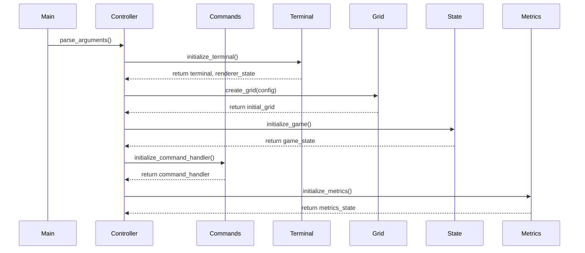
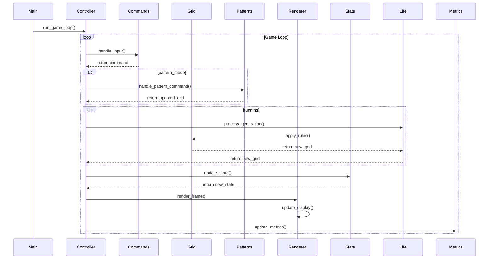
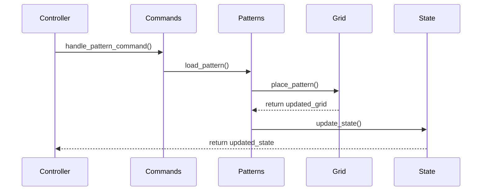
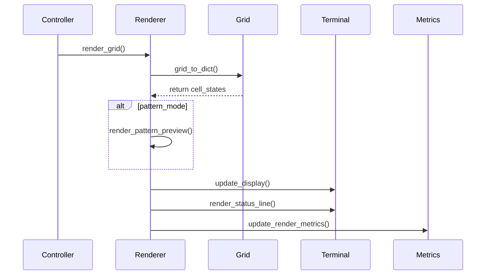
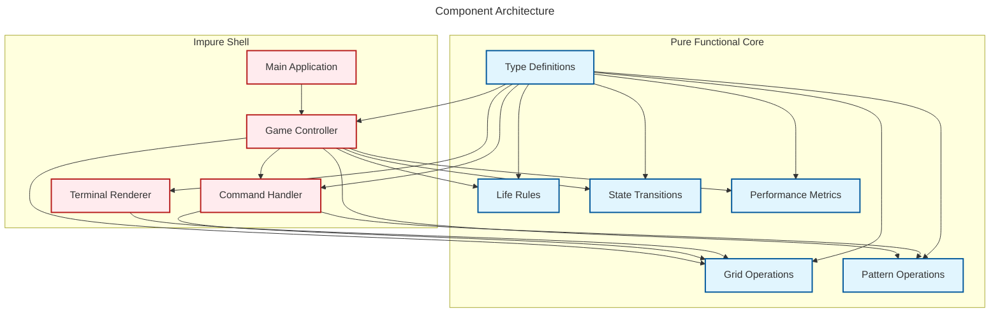
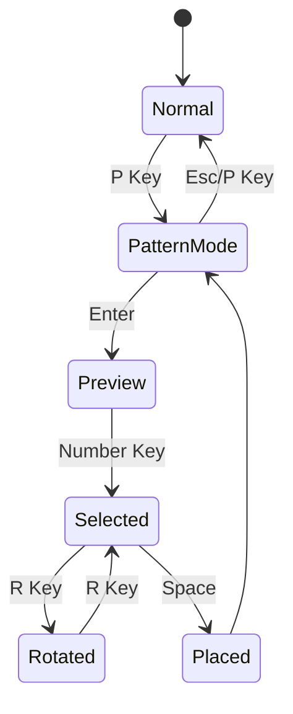

# Component Interaction Diagrams

This document illustrates the key interactions between components in the Game of Life implementation using sequence diagrams.

## Game Initialization Sequence

## Game Loop and Pattern Management

## Pattern System Flow

## Renderer Update Sequence

## Key Architectural Features

The sequence diagrams highlight several important architectural features:

1. **Pure Functions**: All state transitions and pattern operations are pure functions
2. **Immutable State**: Grid and pattern states are immutable
3. **Pattern Management**: Centralized pattern system with metadata
4. **Type Safety**: Strong typing with Protocol classes
5. **Boundary Handling**: Support for multiple boundary conditions
6. **Efficient Updates**: Differential rendering for changed cells only
7. **Performance Monitoring**: Metrics tracking for optimization

The implementation follows functional programming principles with:

- Immutable data structures
- Pure functions for state transitions
- Type-safe operations through protocols
- Pattern-based abstractions
- Performance metrics collection

## Component Architecture

## Pattern State Flow

## Pattern Placement Workflow

1. Enter pattern mode (P key)
2. Select pattern (number keys)
3. Optional: Rotate pattern (R key)
4. Place pattern (Space)
5. Exit pattern mode (Esc)
