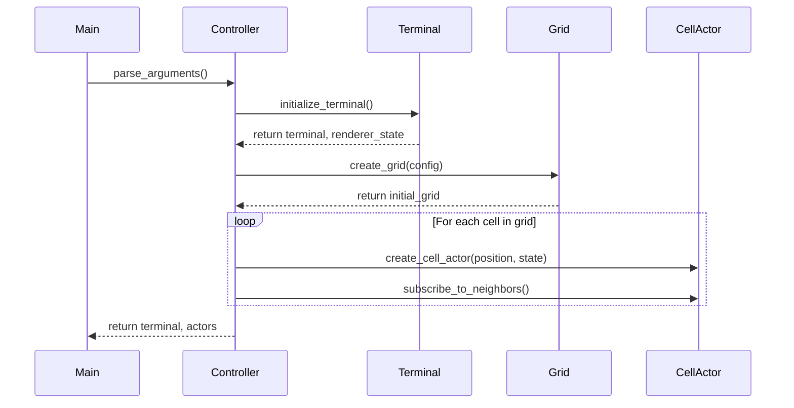
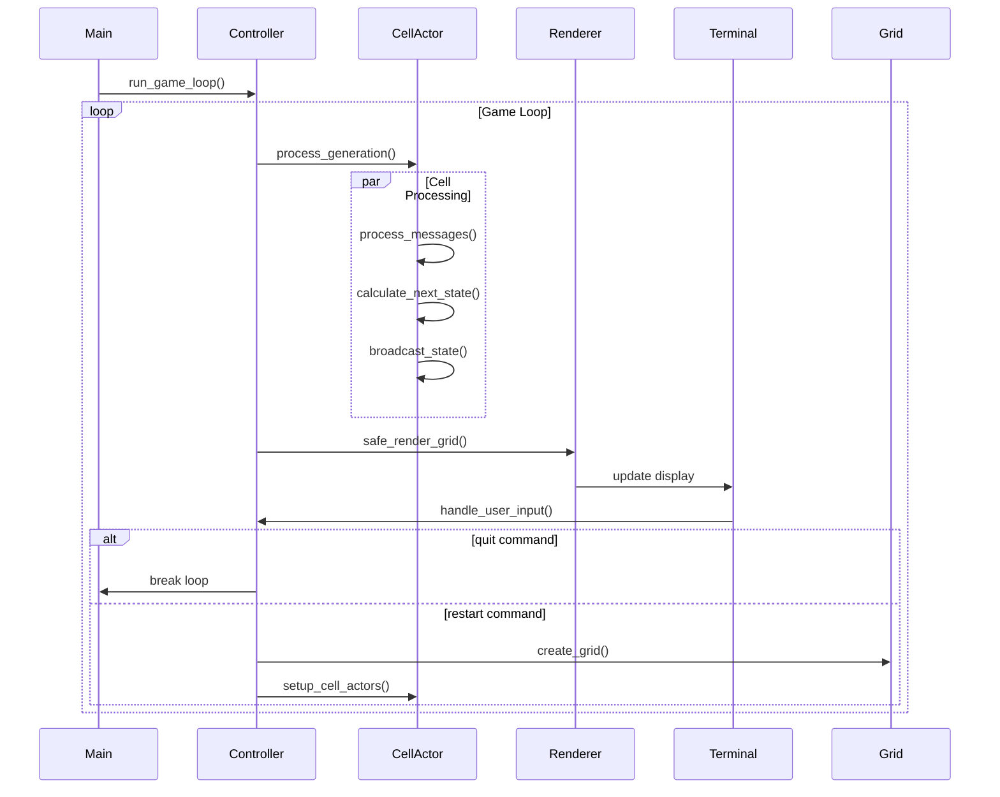
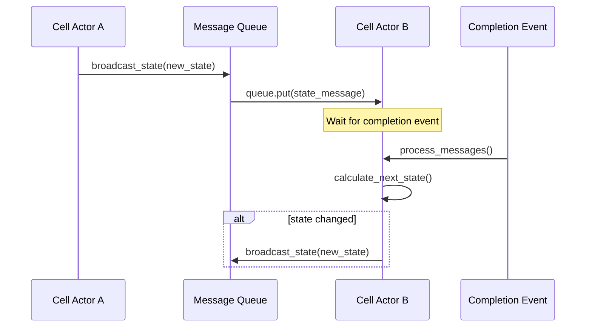
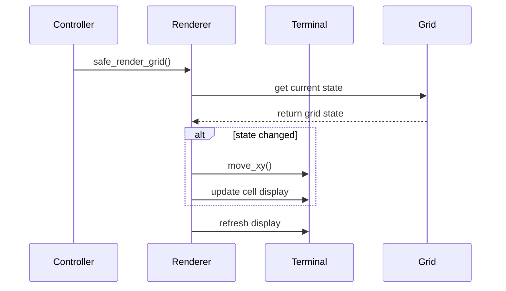
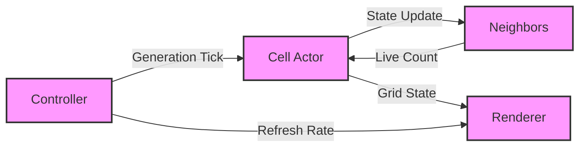
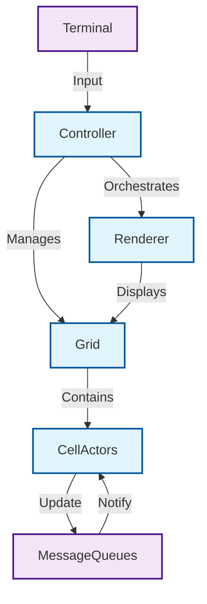
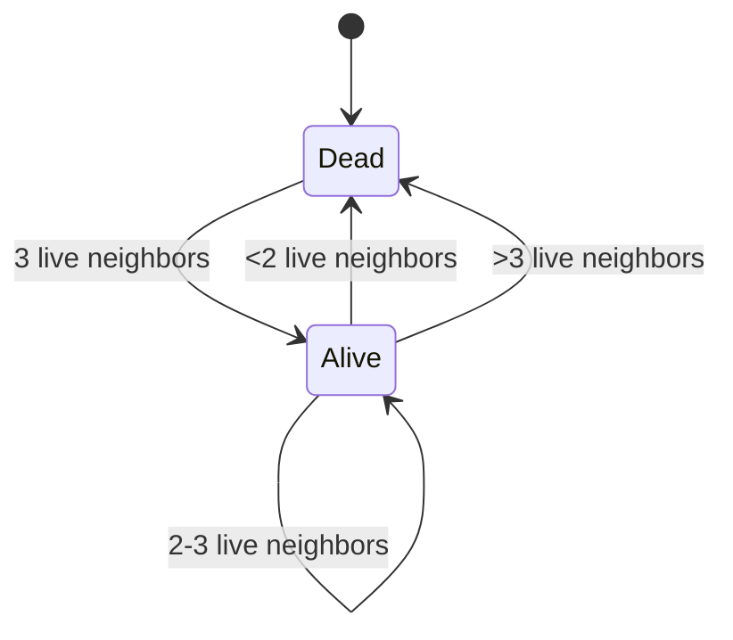

# Component Interaction Diagrams

This document illustrates the key interactions between components in the Game of Life implementation using sequence diagrams.

## 1. Game Initialization Sequence

This diagram shows how the game components are initialized, including terminal setup, grid creation, and actor initialization.

## 2. Game Loop and Cell Interaction Sequence

This diagram illustrates the main game loop, showing how cell processing, rendering, and user input are handled.

## 3. Cell Actor Communication Sequence

This diagram shows how individual cell actors communicate state changes through message queues.

## 4. Renderer Update Sequence

This diagram shows how the game state is visualized in the terminal with differential updates.

## Key Architectural Features

The sequence diagrams highlight several important architectural features of the implementation:

1. **Actor-Based Concurrency**: Each cell operates independently and communicates through message passing
2. **Event-Driven Updates**: State changes are propagated through events and message queues
3. **Differential Rendering**: Only changed cells are updated in the display for better performance
4. **Component Separation**: Clear boundaries between different system components
5. **Thread-Safe Communication**: All inter-actor communication happens through thread-safe message queues
6. **Synchronization**: Completion events ensure proper coordination between components

The implementation follows functional programming principles with:

- Immutable state transitions
- Pure functions for state calculations
- Thread-safe communication patterns
- No shared mutable state

This architecture makes the system robust and well-suited for concurrent execution while maintaining clear separation of concerns. 

# Architecture Diagrams

<!-- Actor Communication Flow -->
## Actor Communication Flow

This diagram illustrates how cell actors communicate with each other and other components:

1. Each cell actor broadcasts its state to neighboring cells
2. Neighbors respond with their live/dead status
3. The renderer receives grid state updates for display
4. The controller orchestrates generation updates and refresh rates

<!-- Component Architecture -->
## Component Architecture

This diagram shows the high-level architecture and relationships between components:

1. The Controller is the central orchestrator
2. Grid manages the game state through Cell Actors
3. Cell Actors communicate via thread-safe Message Queues
4. The Renderer visualizes the grid state
5. Terminal input is processed by the Controller

<!-- Cell State Transitions -->
## Cell State Transitions

This diagram illustrates Conway's Game of Life rules as state transitions:

1. A dead cell becomes alive when it has exactly 3 live neighbors (reproduction)
2. A live cell dies when it has fewer than 2 live neighbors (underpopulation)
3. A live cell dies when it has more than 3 live neighbors (overpopulation)
4. A live cell stays alive when it has 2 or 3 live neighbors (survival)
