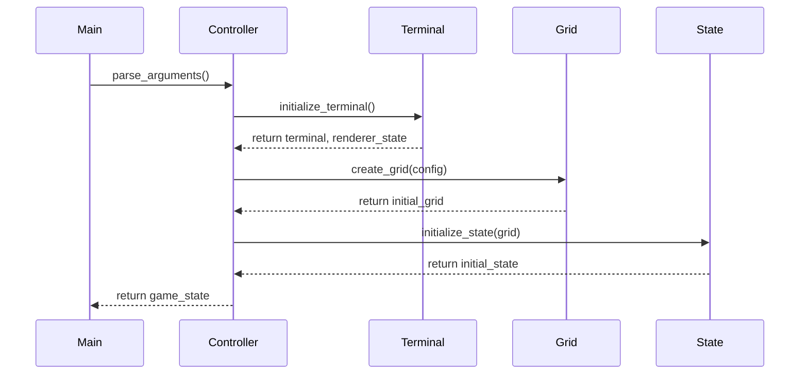
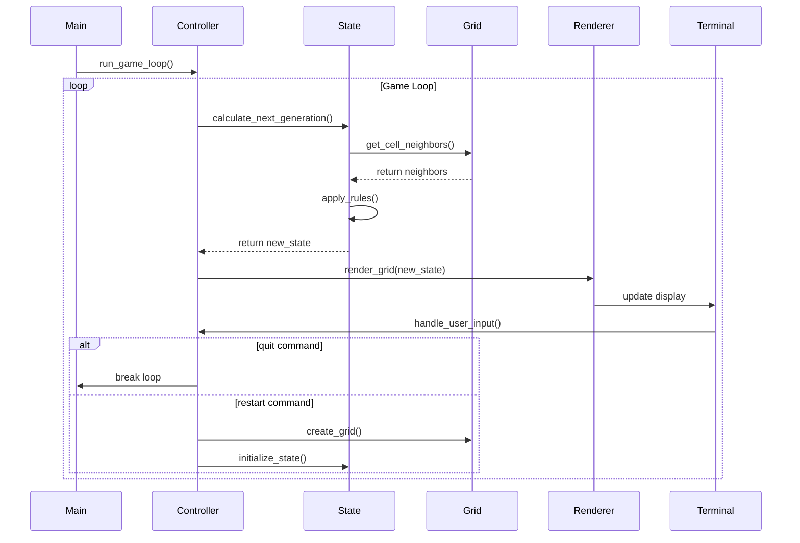
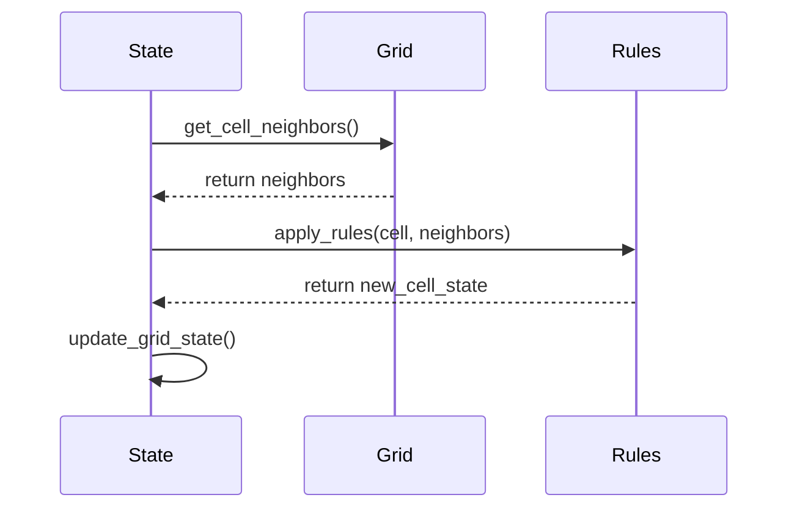
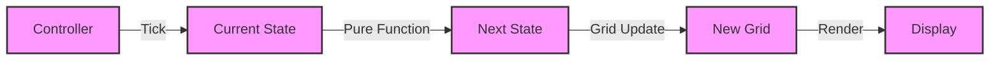
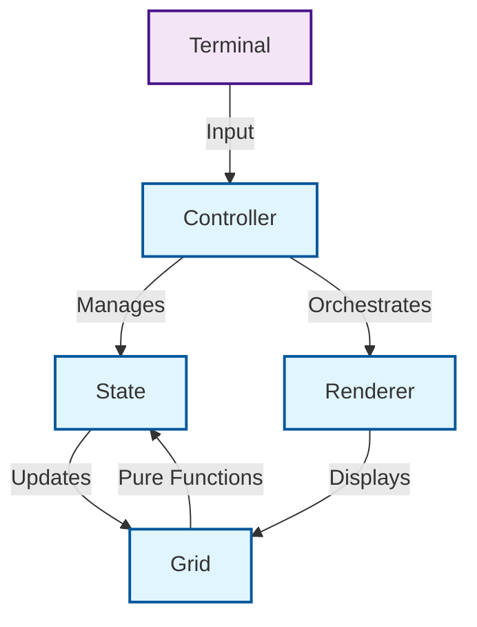
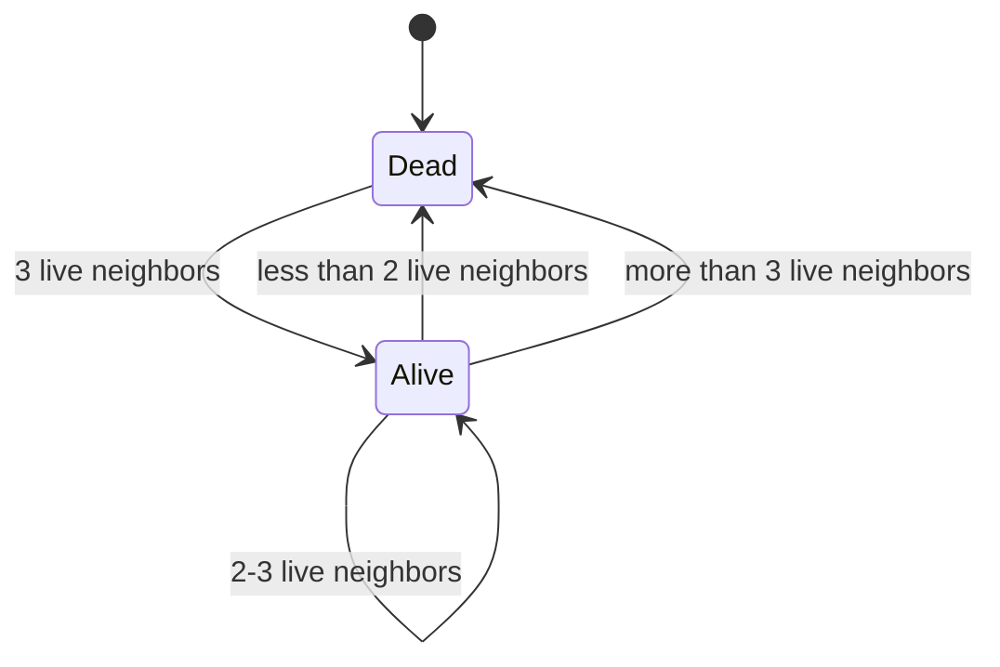

# Component Interaction Diagrams

This document illustrates the key interactions between components in the Game of Life implementation using sequence diagrams.

## 1. Game Initialization Sequence

This diagram shows how the game components are initialized, including terminal setup and grid creation.

## 2. Game Loop and State Transition Sequence

This diagram illustrates the main game loop, showing how state transitions and rendering are handled.

## 3. State Transition Flow

This diagram shows how state transitions are handled through pure functions.

## 4. Renderer Update Sequence

This diagram shows how the game state is visualized in the terminal with differential updates.

## Key Architectural Features

The sequence diagrams highlight several important architectural features of the implementation:

1. **Pure Functions**: All state transitions are handled by pure functions
2. **Immutable State**: State changes create new immutable states
3. **Functional Patterns**: Clear data flow through pure functions
4. **Component Separation**: Clear boundaries between different system components
5. **Type Safety**: Strong typing ensures correct state handling
6. **Efficient Updates**: Only changed cells trigger re-renders

The implementation follows functional programming principles with:

- Immutable state transitions
- Pure functions for state calculations
- Type-safe operations
- No shared mutable state

This architecture makes the system robust and maintainable while ensuring correctness through functional patterns.

# Architecture Diagrams

## State Transition Flow

This diagram illustrates how state transitions flow through pure functions:

1. Current state is processed by pure functions
2. Next state is calculated immutably
3. New grid state is created
4. Display is updated with changes

## Component Architecture

This diagram shows the high-level architecture and relationships between components:

1. The Controller manages game flow
2. State handles immutable transitions
3. Grid provides pure grid operations
4. The Renderer visualizes the grid state
5. Terminal input is processed by the Controller

## Cell State Transitions

This diagram illustrates Conway's Game of Life rules as state transitions:

1. A dead cell becomes alive when it has exactly 3 live neighbors (reproduction)
2. A live cell dies when it has fewer than 2 live neighbors (underpopulation)
3. A live cell dies when it has more than 3 live neighbors (overpopulation)
4. A live cell stays alive when it has 2 or 3 live neighbors (survival)
