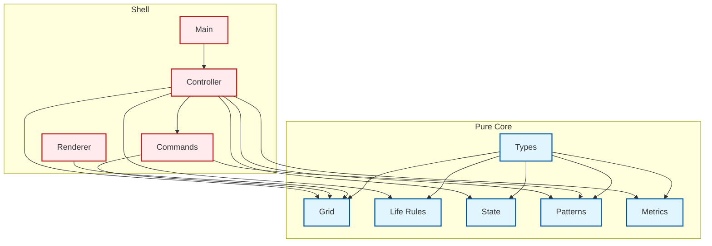
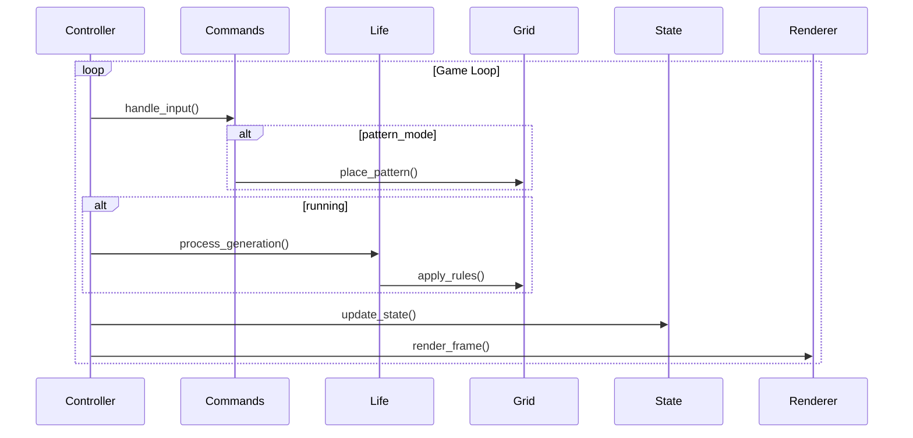
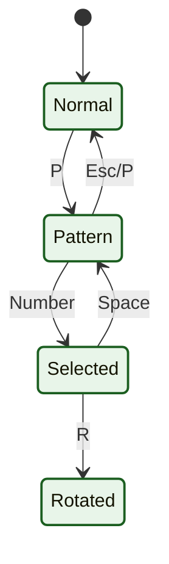
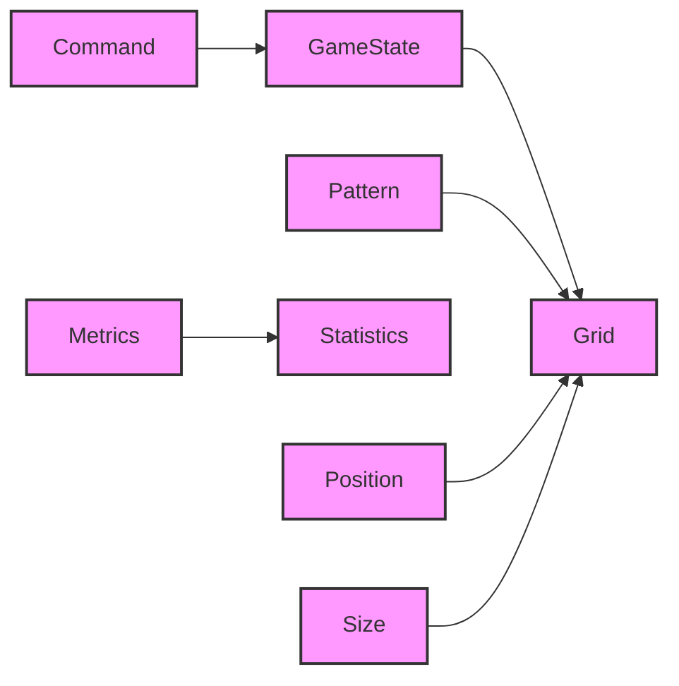

# Architecture Diagrams

## Component Architecture

## Game Loop

## Pattern System

## Type Dependencies

## Key Features

1. **Pure Functions**: All state transitions and pattern operations
2. **Immutable State**: Grid and pattern states
3. **Type Safety**: Protocol classes and type hints
4. **Pattern System**: Metadata and transformations
5. **Performance**: Metrics tracking and optimization
