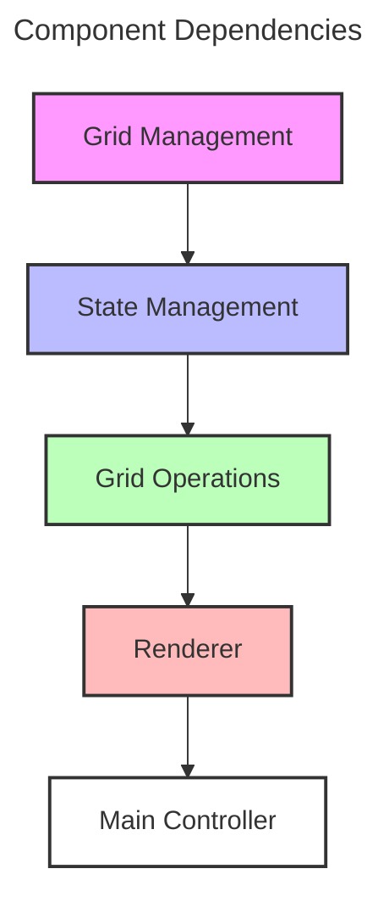

<!-- markdownlint-disable MD024 -->

## Overview

This document outlines the test-driven implementation plan for Conway's Game of Life using a pure functional approach. The implementation follows functional programming principles and is organized by major components.

## Architecture



## Components

### 1. Grid Management & Cell State

Core grid functionality handling the game's state representation.

#### Key Functions

```python
# grid.py
def create_grid(size: int, density: float) -> Grid:
    """Creates initial grid with random cell distribution"""

def get_neighbors(grid: Grid, x: int, y: int) -> list[Position]:
    """Pure function to get valid neighbor positions"""

def count_live_neighbors(grid: Grid, positions: list[Position]) -> int:
    """Pure function to count live neighbors"""
```

#### BDD Tests

```python
# test_grid.py
def test_grid_creation():
    """
    Given a grid size of 10 and density of 0.3
    When creating a new grid
    Then grid should be 10x10
    And approximately 30% of cells should be alive
    """

def test_neighbor_counting():
    """
    Given a grid with known live cells
    When counting neighbors for a specific position
    Then should return correct number of live neighbors
    """
```

### 2. State Management

Pure functional implementation of state transitions.

#### Key Functions

```python
# state.py
def calculate_next_generation(grid: Grid) -> Grid:
    """Pure function to compute next generation state"""

def update_cell_state(cell: Cell, neighbors: list[Cell]) -> Cell:
    """Pure function to compute next cell state"""

def apply_rules(alive: bool, live_neighbors: int) -> bool:
    """Pure function implementing Game of Life rules"""
```

#### BDD Tests

```python
# test_state.py
def test_next_generation():
    """
    Given a grid with known state
    When calculating next generation
    Then should return correct new state
    """

def test_cell_state_update():
    """
    Given a cell with known neighbors
    When updating state
    Then should return correct new state
    """
```

### 3. Grid Operations

Pure functions for grid manipulation and neighbor calculations.

#### Key Functions

```python
# grid_ops.py
def get_cell_neighbors(grid: Grid, pos: Position) -> list[Cell]:
    """Pure function to get cell neighbors"""

def update_grid(grid: Grid, updates: list[CellUpdate]) -> Grid:
    """Pure function to create new grid with updates"""

def create_empty_grid(size: Size) -> Grid:
    """Pure function to create empty grid"""
```

#### BDD Tests

```python
# test_grid_ops.py
def test_neighbor_retrieval():
    """
    Given a grid position
    When getting neighbors
    Then should return correct cells
    """

def test_grid_update():
    """
    Given a list of cell updates
    When applying to grid
    Then should return new grid with updates
    """
```

### 4. Renderer

Terminal-based visualization using the Blessed library.

#### Key Functions

```python
# renderer.py
def initialize_terminal(blessed_terminal) -> Terminal:
    """Sets up blessed terminal interface"""

def render_grid(terminal: Terminal, grid: Grid) -> None:
    """Renders current grid state"""

def handle_user_input(terminal: Terminal) -> UserCommand:
    """Handles keyboard input"""
```

#### BDD Tests

```python
# test_renderer.py
def test_grid_rendering():
    """
    Given a grid with known state
    When rendering
    Then should output correct characters
    """

def test_input_handling():
    """
    Given user presses 'q'
    When handling input
    Then should return exit command
    """
```

### 5. Main Controller

Game orchestration and lifecycle management.

#### Key Functions

```python
# controller.py
def parse_arguments() -> GameConfig:
    """Parses and validates CLI arguments"""

def initialize_game(config: GameConfig) -> GameState:
    """Sets up initial game state"""

def update_game_state(state: GameState) -> GameState:
    """Coordinates cell updates and rendering"""

def cleanup_resources(state: GameState) -> None:
    """Ensures clean shutdown"""
```

#### BDD Tests

```python
# test_controller.py
def test_argument_parsing():
    """
    Given valid CLI arguments
    When parsing
    Then should return correct config
    """

def test_game_initialization():
    """
    Given valid config
    When initializing game
    Then should create correct number of actors
    """
```

## Implementation Order

1. Grid Management
   - Core data structures
   - State representation
   - Grid operations

2. State Management
   - Pure state transitions
   - Rule implementation
   - Generation updates

3. Grid Operations
   - Neighbor calculations
   - Grid updates
   - Boundary handling

4. Renderer
   - Terminal setup
   - Grid visualization
   - Input handling

5. Main Controller
   - Game initialization
   - Update coordination
   - Resource management

## Testing Strategy

Each component follows this test-driven development cycle:

1. Write failing tests
2. Implement minimal code
3. Refactor with test coverage
4. Integration testing
5. Performance testing

> 💡 **Tip:** Start each component by implementing its test suite first.

## Performance Considerations

- Monitor thread usage with different grid sizes
- Measure message queue throughput
- Profile rendering performance
- Test memory usage patterns

## Error Handling

- Validate all inputs
- Handle terminal events
- Manage actor failures
- Ensure clean shutdown

> 🚨 **Warning:** Always implement proper resource cleanup in tests. 

## Core Components

1. **Grid Management**
   - Pure functions for grid operations
   - Immutable grid state
   - Multiple boundary conditions
   - Efficient cell state tracking

2. **Pattern System**
   - Built-in pattern library
   - Custom pattern loading
   - Pattern preview and rotation
   - Centered pattern placement
   - Pattern metadata handling

3. **Game Controller**
   - Game loop management
   - User input handling
   - State transitions
   - Configuration management

4. **Renderer**
   - Terminal-based UI
   - Cell age visualization
   - Pattern preview display
   - Status line updates
   - Differential rendering

## Implementation Principles

1. **Functional Core**
   - Pure functions for state transitions
   - Immutable data structures
   - No shared mutable state
   - Type-safe operations

2. **Pattern Management**
   - Centralized pattern system
   - Pattern metadata
   - File-based storage
   - Pattern validation

3. **User Interface**
   - Clear visual feedback
   - Intuitive controls
   - Responsive updates
   - Mouse support

4. **Testing Strategy**
   - Unit tests for pure functions
   - Integration tests for components
   - Property-based testing
   - Test-driven development

## Project Structure

```
src/gol/
├── main.py           # Application entry point
├── controller.py     # Game controller
├── grid.py          # Grid operations
├── patterns.py      # Pattern management
├── renderer.py      # Terminal UI
└── storage.py       # Pattern storage

tests/
├── test_controller.py
├── test_grid.py
├── test_patterns.py
└── test_renderer.py

patterns/            # Pattern files
└── custom/         # User patterns
```

## Development Workflow

1. **Feature Implementation**
   - Write tests first
   - Implement pure functions
   - Add UI components
   - Integrate with existing code

2. **Testing**
   - Unit tests for functions
   - Integration tests for features
   - Manual testing for UI
   - Performance testing

3. **Documentation**
   - Code documentation
   - User documentation
   - Architecture diagrams
   - Pattern documentation

4. **Maintenance**
   - Code review
   - Performance optimization
   - Bug fixes
   - Feature updates
