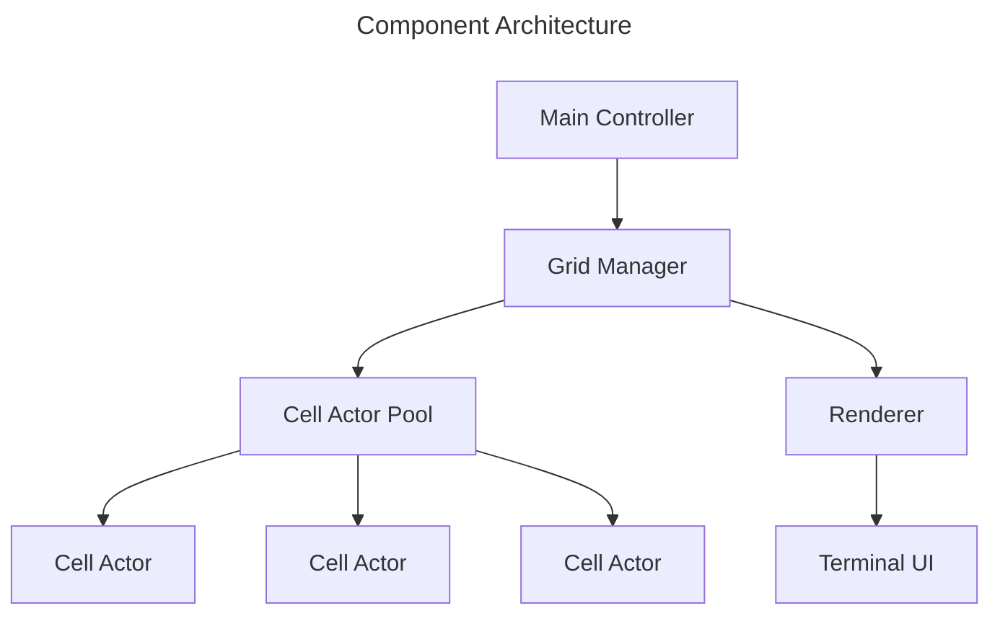
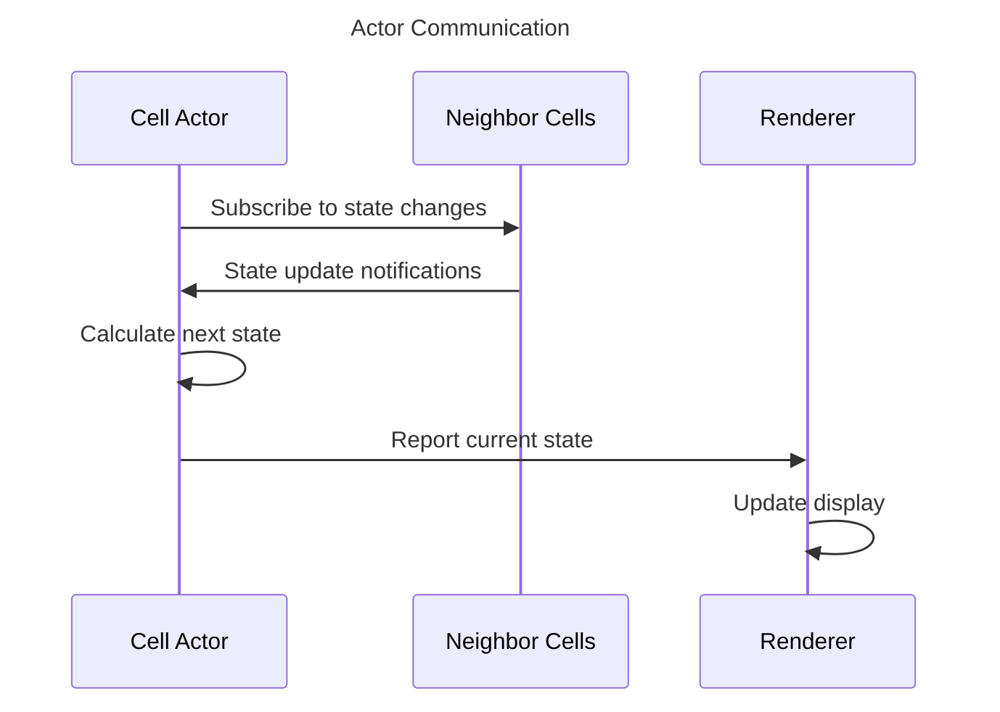

# Terminal Game of Life

## Overview

A terminal-based implementation of Conway's Game of Life using an actor-based concurrent model where each cell operates independently.

## Core Requirements

### Game Rules

1. Universe is a finite N×N grid where N is specified as a command-line argument
2. Each cell is in one of two states: live or dead
3. Each cell interacts with its 8 neighbors (horizontal, vertical, diagonal)
4. State transitions occur simultaneously for all cells based on these rules:
   - Live cell with < 2 live neighbors dies (underpopulation)
   - Live cell with 2-3 live neighbors survives
   - Live cell with > 3 live neighbors dies (overpopulation)
   - Dead cell with exactly 3 live neighbors becomes live (reproduction)

### Technical Requirements

#### Architecture

- Each cell implemented as an independent actor using Python threading
- Actors communicate via thread-safe message queues
- No shared mutable state between cells
- Pure functional approach for state transitions

#### Concurrency Model

- Each cell runs in its own thread (lightweight concurrency)
- Thread-safe message passing using Queue objects
- Synchronization using threading primitives (Event, Barrier)
- Efficient resource usage with thread pooling

#### User Interface

- Full-screen terminal interface using Blessed library
- Grid size determined by command-line argument
- Clear visual distinction between live/dead cells
- Configurable update interval (milliseconds)
- Exit on 'q' or Ctrl-C
- Fixed grid boundaries (no wrapping)

#### Initial State

- Random distribution of live/dead cells
- Configurable initial density of live cells

### Command-Line Interface

The game should be invokable from the command line with the following format:

```bash
gol.py <width> <height> [--interval <ms>] [--density <float>]
```

#### Required Arguments
- `width`: Integer specifying grid width
- `height`: Integer specifying grid height

#### Optional Arguments
- `--interval`: Integer specifying update interval in milliseconds (default: 100)
- `--density`: Float between 0.0 and 1.0 specifying initial live cell density (default: 0.3)
- `--toroidal`: Flag to enable toroidal grid (edges wrap around)

## Technical Design

### Components



### Communication Flow



## Performance Requirements

1. Minimal latency between state updates
2. Efficient message passing between cells
3. Smooth rendering at default interval (100ms)
4. Graceful shutdown on exit

## Error Handling

1. Validate command-line arguments
2. Handle terminal resize events
3. Graceful error recovery for actor failures
4. Clean termination of all threads/processes

## Future Considerations

1. Save/load game states
2. Multiple grid topologies (toroidal, infinite)
3. Custom initial patterns
4. Performance monitoring
5. Different visualization modes 
