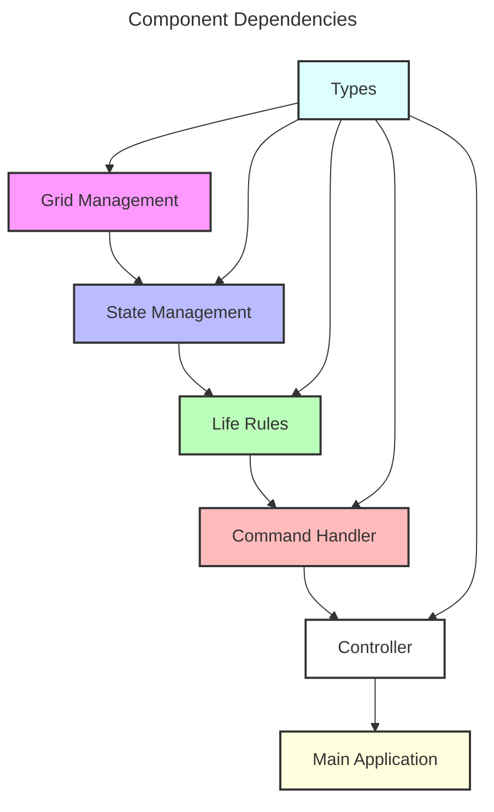

## Overview

This document outlines the test-driven implementation plan for Conway's Game of
Life using a pure functional approach. The implementation follows functional
programming principles and is organized by major components.

## Architecture



## Components

### Type System

Core type definitions for the entire system.

```python
# types.py
Position = tuple[int, int]
Grid = np.ndarray
GameState = TypedDict('GameState', {
    'grid': Grid,
    'running': bool,
    'pattern_mode': bool
})
```

### Grid Management

Pure grid operations and state representation.

```python
# grid.py
def create_grid(size: Size, density: float) -> Grid:
    """Creates initial grid with random cell distribution"""

def get_neighbors(grid: Grid, pos: Position) -> list[Position]:
    """Pure function to get valid neighbor positions"""

def count_live_neighbors(grid: Grid, pos: Position) -> int:
    """Pure function to count live neighbors"""
```

### Life Rules

Pure implementation of Conway's Game of Life rules.

```python
# life.py
def process_generation(grid: Grid) -> Grid:
    """Pure function to compute next generation"""

def apply_rules(grid: Grid, pos: Position) -> bool:
    """Pure function implementing Game of Life rules"""
```

### State Management

Pure state transitions and game state management.

```python
# state.py
def update_state(state: GameState, grid: Grid) -> GameState:
    """Pure function to update game state"""

def toggle_running(state: GameState) -> GameState:
    """Pure function to toggle simulation state"""
```

### Pattern System

Pattern management and manipulation.

```python
# patterns.py
def load_pattern(name: str) -> Pattern:
    """Load pattern from definition"""

def place_pattern(grid: Grid, pattern: Pattern, pos: Position) -> Grid:
    """Pure function to place pattern on grid"""

def rotate_pattern(pattern: Pattern) -> Pattern:
    """Pure function to rotate pattern"""
```

### Command Handler

User input processing and command execution.

```python
# commands.py
def handle_input(terminal: Terminal) -> Command:
    """Process user input into commands"""

def handle_pattern_command(cmd: Command, state: GameState) -> GameState:
    """Handle pattern-related commands"""

def handle_game_command(cmd: Command, state: GameState) -> GameState:
    """Handle game control commands"""
```

### Renderer

Terminal-based visualization.

```python
# renderer.py
def render_frame(terminal: Terminal, state: GameState) -> None:
    """Render current game state"""

def render_pattern_preview(terminal: Terminal, pattern: Pattern) -> None:
    """Render pattern preview in pattern mode"""

def render_status(terminal: Terminal, state: GameState) -> None:
    """Render status information"""
```

### Controller

Game orchestration and lifecycle management.

```python
# controller.py
def parse_arguments() -> GameConfig:
    """Parse and validate CLI arguments"""

def initialize_game(config: GameConfig) -> GameState:
    """Set up initial game state"""

def run_game_loop(state: GameState) -> None:
    """Main game loop coordination"""
```

### Main Application

Entry point and application setup.

```python
# main.py
def main() -> None:
    """Application entry point"""

def setup_logging() -> None:
    """Configure logging system"""

def handle_signals() -> None:
    """Set up signal handlers"""
```

## Implementation Order

1. Type System
    - Core type definitions
    - Type aliases
    - Protocol classes

2. Grid Management
    - Grid operations
    - Neighbor calculations
    - Boundary handling

3. Life Rules
    - Rule implementation
    - Generation processing
    - State transitions

4. State Management
    - Game state updates
    - Mode transitions
    - State validation

5. Pattern System
    - Pattern loading
    - Pattern manipulation
    - Pattern placement

6. Command Handler
    - Input processing
    - Command execution
    - Mode-specific handling

7. Renderer
    - Terminal setup
    - Frame rendering
    - Status display

8. Controller
    - Game initialization
    - Loop coordination
    - State management

9. Main Application
    - Entry point
    - Configuration
    - Signal handling

## Testing Strategy

Each component should have corresponding test files following BDD patterns:

```python
# test_grid.py
def test_grid_creation():
    """
    Given: A grid size and density
    When: Creating a new grid
    Then: Grid should have correct dimensions and density
    """

# test_life.py
def test_rule_application():
    """
    Given: A cell with known neighbors
    When: Applying life rules
    Then: Cell should transition to correct state
    """

# test_patterns.py
def test_pattern_placement():
    """
    Given: A grid and pattern
    When: Placing pattern at position
    Then: Grid should contain pattern at correct location
    """
```

## Performance Considerations

```python
# metrics.py
def update_metrics(metrics: Metrics, frame_time: float) -> Metrics:
    """Update performance metrics"""

def calculate_statistics(metrics: Metrics) -> Statistics:
    """Calculate performance statistics"""
```

## Error Handling

- Use Result types for operations that can fail
- Validate inputs at system boundaries
- Log errors with appropriate context
- Maintain pure error handling in core
