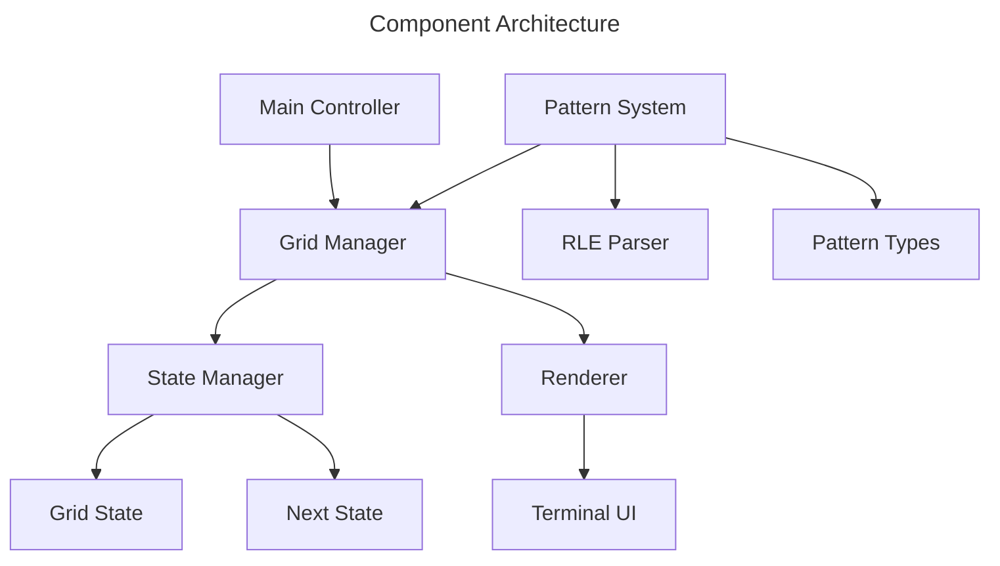
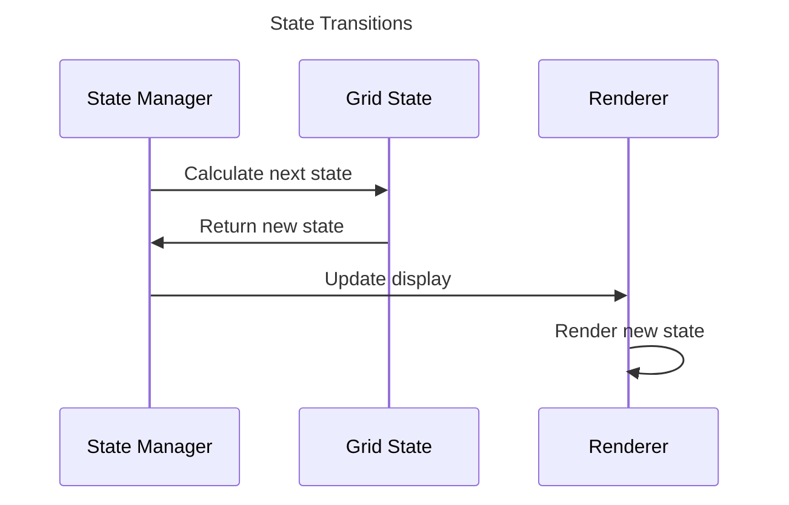

# Terminal Game of Life

## Overview

A terminal-based implementation of Conway's Game of Life using a pure functional
approach with immutable state transitions.

## Core Requirements

### Game Rules

1. Universe is a finite N×N grid where N is specified as a command-line argument
2. Each cell is in one of two states: live or dead
3. Each cell interacts with its 8 neighbors (horizontal, vertical, diagonal)
4. State transitions occur simultaneously for all cells based on these rules:
   - Live cell with < 2 live neighbors dies (underpopulation)
   - Live cell with 2-3 live neighbors survives
   - Live cell with > 3 live neighbors dies (overpopulation)
   - Dead cell with exactly 3 live neighbors becomes live (reproduction)

### Technical Requirements

#### Architecture

- Pure functional implementation with immutable state transitions
- No shared mutable state
- Thread-safe operations using functional patterns
- Efficient state management with immutable data structures

#### Concurrency Model

- Functional concurrency patterns
- Thread-safe operations through immutability
- Synchronization using pure functional constructs
- Efficient resource usage with functional patterns

#### User Interface

- Full-screen terminal interface using Blessed library
- Grid size determined by command-line argument
- Clear visual distinction between live/dead cells
- Visible grid always centered in terminal window
- Configurable update interval (milliseconds)
- Exit on 'q' or Ctrl-C
- Fixed grid boundaries (no wrapping)

#### Initial State

- Random distribution of live/dead cells
- Configurable initial density of live cells

### Command-Line Interface

The game should be invokable from the command line with the following format:

```bash
game.py [--width <width>] [--height <height>] [--interval <ms>] \
        [--density <float>] [--boundary <type>]
```

#### Optional Arguments

- `--width`: Grid width (auto-sized if 0, min 30)
- `--height`: Grid height (auto-sized if 0, min 20)
- `--interval`: Update interval in ms (default: 200)
- `--density`: Float between 0.0 and 1.0 for initial density (default: 0.3)
- `--boundary`: Boundary type: 'finite', 'toroidal', 'infinite' (default: finite)

The grid dimensions will automatically adjust to fit the terminal window if
not specified or set to 0, while maintaining minimum playable dimensions.

## Technical Design

### Components



### Communication Flow



## Performance Requirements

1. Minimal latency between state updates
2. Efficient message passing between cells
3. Smooth rendering at default interval (200ms)
4. Graceful shutdown on exit

## Error Handling

1. Validate command-line arguments
2. Handle terminal resize events
3. Graceful error recovery for actor failures
4. Clean termination of all threads/processes

## Future Considerations

1. Save/load game states
2. Multiple grid topologies (toroidal, infinite)
3. Custom initial patterns
4. Performance monitoring
5. Different visualization modes
