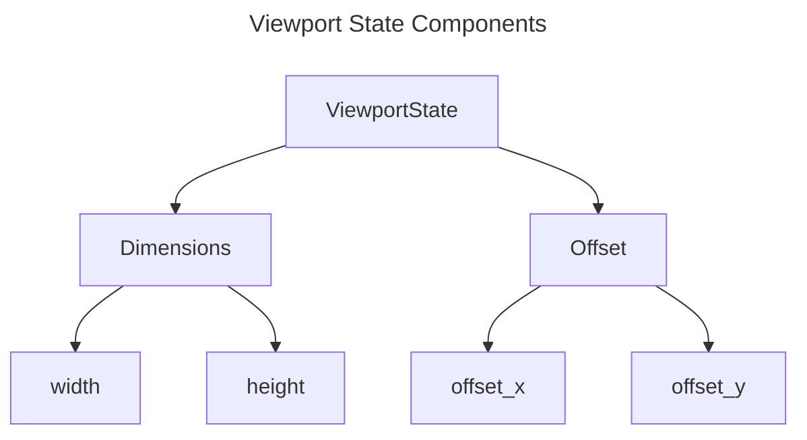
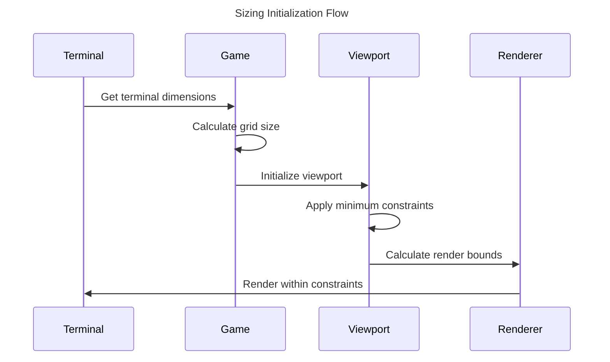

# Viewport and Grid Sizing

## Overview

This document describes how viewport sizing works in relation to game and grid dimensions in the Game of Life implementation. The system uses a layered approach to manage different view contexts while maintaining proper boundaries and constraints.

## Components

### Viewport State

The viewport represents the visible portion of the game grid that can be seen in the terminal window. It has:

- Dimensions (width, height)
- Offset position (x, y)
- Minimum size constraints



### Grid System

The game grid is the actual playing field where cells live and die. It has:

- Fixed dimensions
- Boundary conditions
- Cell state storage

### Terminal Constraints

The terminal window provides the ultimate constraints for rendering:

- Available width and height
- Status line reservation
- Cell display width (2 characters per cell)

## Initialization Flow



## Sizing Rules

### Grid Sizing

1. Initial grid dimensions are determined by:
   - Terminal size
   - Minimum game requirements
   - User preferences (if specified)

2. Grid boundaries are enforced through:
   - Finite mode: Fixed boundaries
   - Toroidal mode: Wrapping boundaries
   - Infinite mode: Expandable boundaries

3. Expandable Boundaries (Infinite Mode):
   ```mermaid
   ---
   title: Grid Expansion in Infinite Mode
   ---
   graph TD
      A[Check Cell Position] --> B{Outside Current Grid?}
      B -->|No| C[Use Existing Grid]
      B -->|Yes| D[Calculate New Dimensions]
      D --> E[Create Expanded Grid]
      E --> F[Copy Existing State]
      F --> G[Update Grid Reference]
   ```

   The grid automatically expands when:
   - A pattern is placed beyond current boundaries
   - Living cells reach the grid edges
   - Viewport is panned beyond current dimensions

   Expansion behavior:
   ```python
   # When a cell or pattern exceeds current bounds
   new_width = max(current_width, required_x + EXPANSION_MARGIN)
   new_height = max(current_height, required_y + EXPANSION_MARGIN)
   
   # EXPANSION_MARGIN provides buffer space (default: 20 cells)
   # This prevents frequent resizing during pattern evolution
   ```

   State preservation:
   - Current grid state is copied to the expanded grid
   - New cells are initialized as dead
   - Grid center remains aligned with original center
   - Coordinate system maintains consistency

   Performance considerations:
   > 💡 **Tip:** Grid expansion is optimized to minimize memory reallocation by using the expansion margin.

   Constraints:
   > 🚨 **Warning:** Grid expansion is limited by available system memory. Very large patterns may require manual size configuration.

### Viewport Sizing

1. Default viewport dimensions:
   - Width: 40 cells
   - Height: 25 cells

2. Minimum constraints:
   - Width: 20 cells
   - Height: 10 cells

3. Resize operations:
   - Expand: Increase both dimensions by 4
   - Shrink: Decrease both dimensions by 4
   - Maintain minimum size constraints

### Terminal Constraints

1. Cell rendering:
   - Each cell requires 2 characters width
   - One character height per cell
   - Status line requires 1 line at bottom

2. Available space calculation:
   ```
   available_width = terminal_width // 2  # Due to cell width
   available_height = terminal_height - 1  # Reserve status line
   ```

## Viewport Operations

### Panning

The viewport can be panned within grid boundaries:

```python
max_x_offset = grid_width - viewport_width
max_y_offset = grid_height - viewport_height
```

### Resizing

Viewport resizing maintains state and constraints:

```python
new_width = current_width + (4 if expanding else -4)
new_height = current_height + (4 if expanding else -4)
new_width = max(20, new_width)   # Minimum width
new_height = max(10, new_height) # Minimum height
```

## Examples

### Default Initialization

```python
viewport = ViewportState(dimensions=(40, 25))
assert viewport.offset_x == 0
assert viewport.offset_y == 0
```

### Custom Initialization

```python
viewport = ViewportState(
    dimensions=(30, 20),
    offset_x=5,
    offset_y=-3
)
```

## Implementation Notes

> 💡 **Tip:** Always check terminal dimensions before rendering to ensure proper display.

> ℹ️ **Note:** The viewport system uses immutable state management to prevent unexpected modifications.

> 🚨 **Warning:** Grid boundaries must be respected when panning to prevent undefined behavior. 